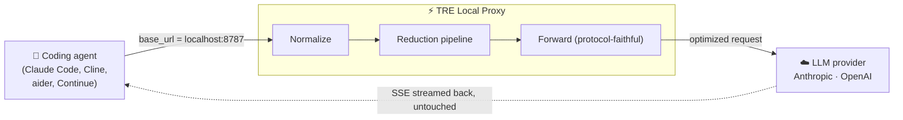
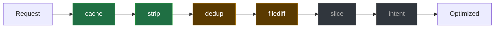
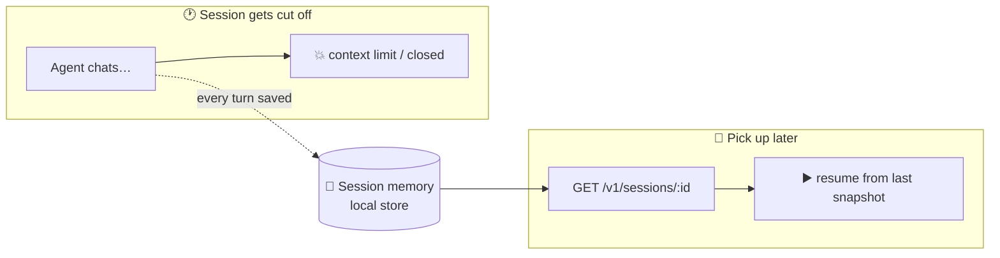
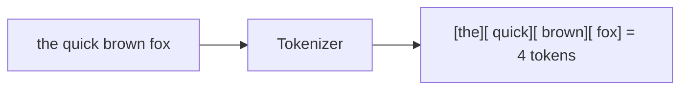
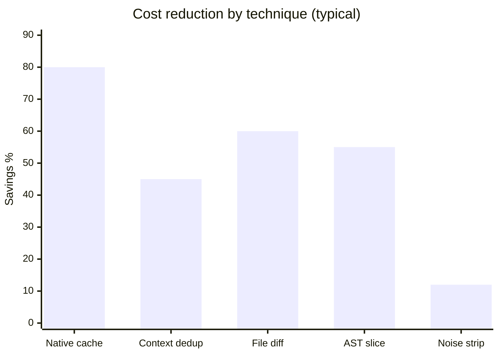

<div align="center">

# ⚡ Token Reduction Engine (TRE)

**A transparent local proxy that cuts LLM token cost — without degrading context quality.**

TRE is built to **reduce the tokens every request spends**, so you get **more output from your AI for fewer tokens** — more turns before you hit a rate limit, more work inside the same context window, and a smaller bill for the same results.

Point any coding agent at it. It speaks the provider's exact wire protocol, so nothing in your setup changes but the bill.


</div>

---

## Why TRE?

| 💸 Cheaper | 🚀 More output | 🔌 Drop-in | 🔒 Local-first |
|---|---|---|---|
| Exploits native prompt caching + dedup + diffing to cut spend **50–90%** | Fewer tokens per request = more turns before rate limits and more room in the context window | Any client with a custom base URL works (Claude Code, Cline, aider, Continue…) | Binds `127.0.0.1`; your prompts never leave the machine |

> **Fewer tokens in → more useful work out.** The product is **cheaper requests that still work**
> — not just *smaller* requests. No lossy stage ships on until it proves **≥99% task accuracy**, so
> every reduction is measured against task success, not only token delta.

---

## How it works



The proxy is **transparent**: it talks the same protocol as the upstream, so clients need
zero code changes beyond pointing the base URL.

### The pipeline (conservative → aggressive)



<sub>🟢 lossless, **on by default** &nbsp;&nbsp; 🟠 lossy, opt-in (toggle in the dashboard) &nbsp;&nbsp; ⚪ experimental</sub>

| Stage | What it does | Default |
|---|---|---|
| **cache** | Marks the stable prefix for provider-native prompt caching (lossless) | ✅ on |
| **strip** | Trims whitespace + removes exact-duplicate boilerplate (lossless) | ✅ on |
| **dedup** | Collapses a large block re-sent verbatim later in the same conversation | opt-in |
| **filediff** | Replaces a re-sent file with a unified diff vs. its previous version | opt-in |
| **slice / intent** | AST slicing / metadata extraction | experimental |

Each stage is independently toggleable, its savings are **measured with a real tokenizer** (never
self-reported), and any lossy stage that doesn't beat a token threshold is **auto-reverted** that
request — so a stage can never make a request *bigger*.

---

## 🧠 Session memory & resume

Because the proxy sees **every turn** of every conversation, it can remember them. So when your
agent is closed, crashes, or a chat **hits the context-window limit and gets cut off**, you don't
start over — you **resume from exactly where you left off**.



- 🗂️ **Unlimited sessions** — keep as many conversations as you want, each under its own id
  (pass `x-tre-session: my-project`); list and resume any of them anytime.
- ▶️ **One-call resume** — the latest full conversation snapshot is returned ready to continue.
- 📊 **Per-session timeline** — turns, models used, and cumulative token spend.
- 🔒 **Yours & local** — stored on your machine only; disable with `--no-store`, wipe with a `DELETE`.

| Endpoint | What it does |
|---|---|
| `GET /v1/sessions` | List every resumable session (most recent first) |
| `GET /v1/sessions/:id` | Resume — returns the conversation snapshot + timeline |
| `DELETE /v1/sessions/:id` | Purge a session (privacy / TTL) |

```bash
# see what you can pick back up
curl http://127.0.0.1:8787/v1/sessions

# resume a specific project's conversation
curl http://127.0.0.1:8787/v1/sessions/my-project
```

> In-memory today; **sessions will be persisted to SQLite** so they survive a proxy restart.

---

## How tokens are counted

LLMs don't bill by characters or words — they bill by **tokens**, the sub-word chunks a model's
tokenizer splits text into (≈ ¾ of a word in English; code is denser). Every byte of your system
prompt, tool schemas, file contents, and chat history counts on **every** request, which is why
re-sending unchanged context gets expensive fast.



TRE measures **before and after** every reduction with a real per-model tokenizer, so the savings
log reflects what you're actually billed — not an estimate. Want to see how your own prompts
tokenize? Plenty of tools out there:

**🔬 Interactive playgrounds (paste text, see tokens)**
- **OpenAI Tokenizer** — https://platform.openai.com/tokenizer
- **Tiktokenizer** (compare GPT/Claude/Llama side-by-side) — https://tiktokenizer.vercel.app
- **The Tokenizer Playground** (Xenova, many open models) — https://huggingface.co/spaces/Xenova/the-tokenizer-playground
- **gpt-tokenizer playground** — https://gpt-tokenizer.dev
- **Llama / Mistral token counter** (belladore) — https://belladore.ai/tools/llama-tokenizer
- **Token Counter** (multi-model, quick estimate) — https://token-counter.app

**🧩 Libraries & per-provider APIs (exact counts in code)**
- **`tiktoken`** — OpenAI's BPE tokenizer (GPT models) — https://github.com/openai/tiktoken
- **`gpt-tokenizer`** — fast pure-JS tiktoken — https://github.com/niieani/gpt-tokenizer
- **Anthropic token-counting API** (Claude) — https://docs.anthropic.com/en/docs/build-with-claude/token-counting
- **Google Gemini `countTokens`** — https://ai.google.dev/gemini-api/docs/tokens
- **Mistral tokenizer** — https://docs.mistral.ai/guides/tokenization/
- **Cohere `tokenize` API** — https://docs.cohere.com/reference/tokenize
- **Hugging Face `tokenizers`** (open models) — https://github.com/huggingface/tokenizers

**📖 Background**
- **What are tokens & how to count them (OpenAI)** — https://help.openai.com/en/articles/4936856-what-are-tokens-and-how-to-count-them

> The proxy counts with a **real BPE tokenizer** (`gpt-tokenizer`) — exact for OpenAI models and a
> close estimate for other providers (clearly flagged) — so the savings log reflects what you're
> actually billed. Char-count estimates are never used for spend decisions.

---

## Expected savings



| Technique | Realistic savings | Risk |
|---|---|---|
| Native prompt caching | **50–90%** on cost | None |
| Context dedup (cross-turn) | 20–60% | Low |
| Diff instead of whole files | 30–80% on file payloads | Low–Med |
| AST-aware file slicing | 40–70% per file | Med |
| Boilerplate stripping | 5–20% | Low |

---

## Quick start

```bash
pnpm install
pnpm --filter @tre/proxy build
node packages/proxy/dist/index.js
```

Then point any agent at the proxy:

```bash
# Claude Code (Anthropic)
export ANTHROPIC_BASE_URL=http://127.0.0.1:8787

# OpenAI-compatible clients (Cline, Continue, aider…)
export OPENAI_BASE_URL=http://127.0.0.1:8787/v1
```

That's it — run your agent normally. Watch the savings log:

```
[tre] model=claude-opus-4-8 before=18420 after=7310 saved=11110 (60.3%) 4.2ms
```

### Configure (env vars)

| Var | Default | Purpose |
|---|---|---|
| `TRE_PORT` | `8787` | Port to listen on |
| `TRE_HOST` | `127.0.0.1` | Bind address (local-only) |
| `TRE_ANTHROPIC_UPSTREAM` | `https://api.anthropic.com` | Where to forward Anthropic calls |
| `TRE_OPENAI_UPSTREAM` | `https://api.openai.com` | Where to forward OpenAI calls |
| `TRE_LOG_REQUESTS` | `true` | Per-request savings logging (keys redacted) |

---

## 🖥️ Dashboard & token calculator

A local web UI visualizes everything the proxy sees — savings over time, recent requests,
resumable sessions — and lets you flip pipeline stages on/off **live**. It also ships a
**token calculator**: paste any prompt/file and see the token count, characters-per-token, and a
rough input-cost estimate per model.

```bash
node packages/proxy/dist/index.js          # proxy on :8787
pnpm --filter @tre/dashboard dev           # dashboard on :5173
```

```
┌──────────────────────────────────────────────────────────────┐
│ ⚡ Token Reduction Engine                   ● proxy connected  │
│ [📊 Overview] [📜 Requests] [🎛 Stages] [🧠 Sessions] [🔢 Calc]│
├──────────────────────────────────────────────────────────────┤
│  Requests   Tokens saved   Reduction   Avg overhead            │
│    1,284       512,900       41.7%        4.2 ms               │
│                                                                │
│  Overall reduction  ▓▓▓▓▓▓▓▓▓▓▓▓▓░░░░░░░░░░  41.7% saved       │
│                                                                │
│  Savings by model                                              │
│  claude-opus-4-8  ███████████▓▓▓▓  812k                        │
│  gpt-4o           ██████▓▓▓        318k                        │
└──────────────────────────────────────────────────────────────┘
```

It talks to read-only management endpoints on the proxy — no cloud egress:

| Endpoint | Purpose |
|---|---|
| `GET /v1/metrics` | Aggregate savings + recent requests |
| `GET` / `PATCH /v1/config` | Read / live-toggle pipeline stages |
| `POST /v1/tokenize` | Token calculator (count tokens for text) |
| `GET /v1/sessions` · `/v1/sessions/:id` | List / resume saved conversations |

---

## Repo layout

```
packages/
  core/        @tre/core   — reduction pipeline, stages, tokenizer, stores (pure)
  proxy/       @tre/proxy   — Hono server, Anthropic + OpenAI, SSE, dashboard API, persistence
  mcp/         @tre/mcp     — context-store MCP server (context.put / context.get)
  vscode-ext/  tre-vscode   — VS Code extension (status-bar savings + commands)
apps/
  dashboard/   @tre/dashboard — local savings UI + token calculator (Vite + React)
```

## Persistence

Sessions + metrics are in-memory by default. Set a data directory to keep them across restarts:

```bash
TRE_DATA_DIR=~/.tre node packages/proxy/dist/index.js   # writes sessions.json + metrics.json
```

## MCP server

For MCP-aware clients, a context store is exposed over stdio (`context.put` → short id,
`context.get` → expand), so clients can stash stable context once and reference it by id:

```bash
node packages/mcp/dist/index.js     # stdio MCP server: tre-context
```

## Roadmap


**Status:** end-to-end working. Lossless reduction (cache + strip) is on by default; lossy stages
(dedup, filediff) are implemented and one toggle away in the dashboard. Exact tokenization, session
resume + disk persistence, the MCP context server, and the VS Code extension are all built. Next:
benchmark the lossy stages to a ≥99% task-success bar before flipping them on by default.

## Develop

```bash
pnpm -r build          # build every package
pnpm -r test           # vitest — 158 tests
pnpm test:coverage     # coverage report (~99% on core + proxy)
pnpm smoke             # runtime check against compiled dist
pnpm dev:proxy         # run the proxy with hot reload
pnpm --filter @tre/dashboard dev   # run the dashboard
```

<div align="center"><sub>Local-first · protocol-faithful · accuracy-gated</sub></div>
